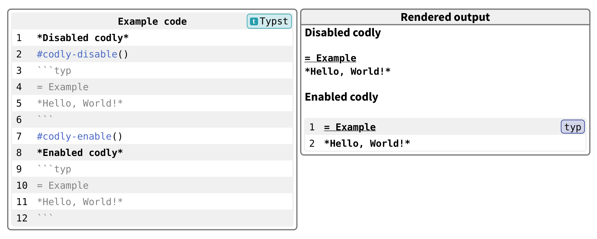
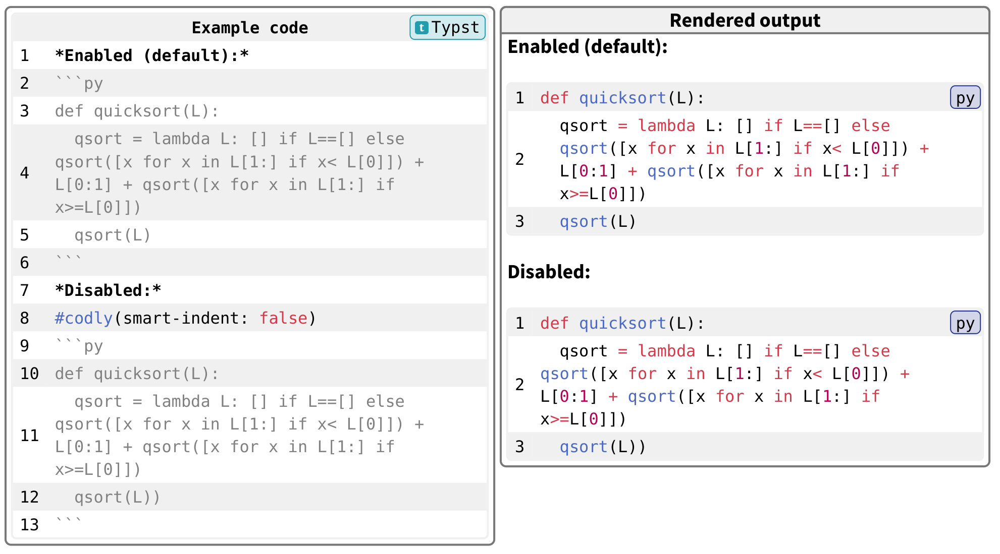
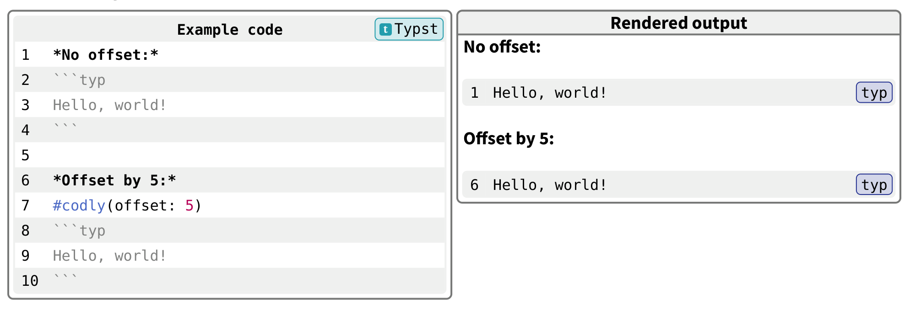
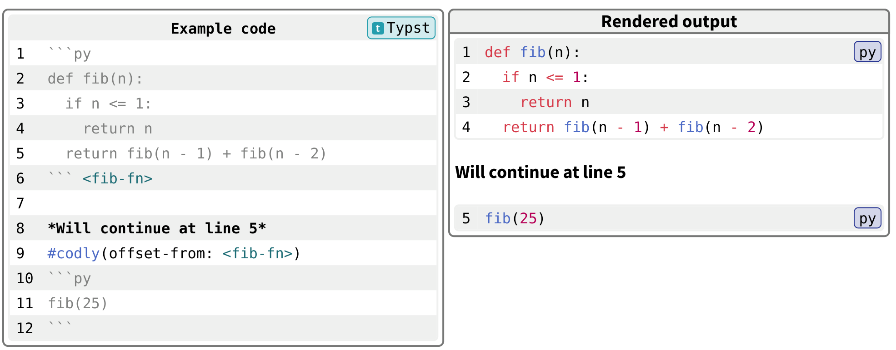
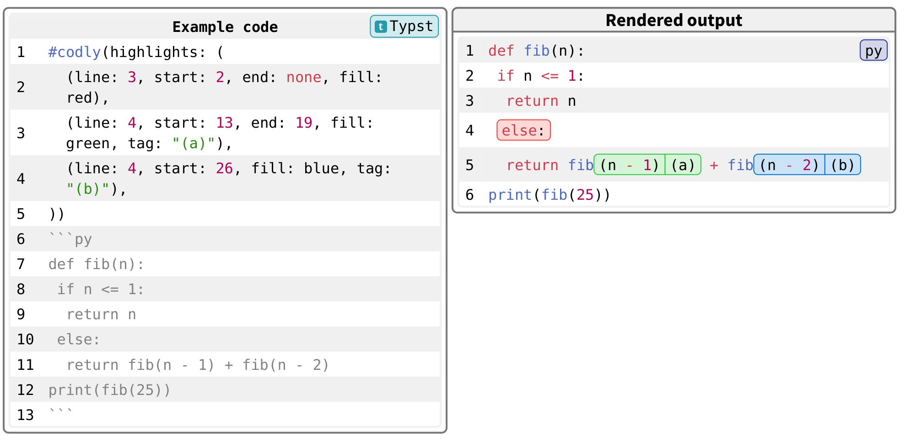
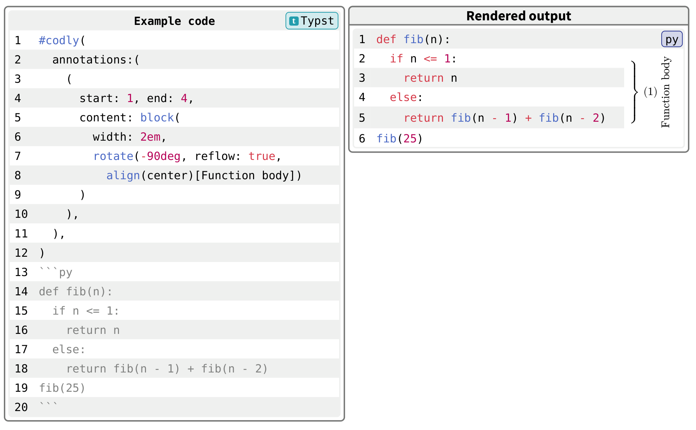

# Codly: simple and powerful code blocks

<p align="center">
  <a href="https://github.com/Dherse/codly/blob/main/docs.pdf">
    
  </a>
  <a href="https://github.com/Dherse/codly/blob/main/LICENSE">
    
  </a>
  
</p>

Codly superchargescode blocks for your Typst documents. It allows you to add annotations, skip lines, customize numberings, add language icons, and much more.

A full set of documentation can be found [in the repo](https://raw.githubusercontent.com/Dherse/codly/main/docs.pdf).


````typ
#import "@preview/codly:1.1.0": *
#import "@preview/codly-languages:0.1.1": *
#show: codly-init.with()

#codly(languages: codly-languages)
```rust
pub fn main() {
    println!("Hello, world!");
}
```
````

### Setup

To start using codly, you need to initialize codly using a show rule, this need only be done once per document:

```typ
#show: codly-init.with()
```

Then you *can* configure codly with your parameters:

```typ
#codly(
  languages: (
    rust: (name: "Rust", icon: "🦀", color: rgb("#CE412B")),
  )
)
```
> **Note**: Any parameter that you leave blank will use the previous values (or the default value if never set) similar to a `set` rule in regular typst. But the changes are always global unless you use the provided `codly.local` function. To get a full list of all settings, see the [documentation](https://raw.githubusercontent.com/Dherse/codly/main/docs.pdf).

Then you just need to add a code block and it will be automatically displayed correctly:

````
```rust
pub fn main() {
    println!("Hello, world!");
}
```
````


### Disabling & Enabling

To locally disable codly, you can just do the following, you can then later re-enable it using the `codly` configuration function.

```typ
#codly-disable()
```



Alternatively, you can use the `no-codly` function to achieve the same effect locally:

````typ
#no-codly[
  ```typ
  I will be displayed using the normal raw blocks.
  ```
]
````

### Smart indentation

By default Codly ships with `smart-indent` enabled, this means that Codly will automatically detect the indentation of your code block and adjust the horizontal offset on line wrapping accordingly. This can be disabled using the `smart-indent` parameter.

```typ
#codly(smart-indent: false)
```



### Referencing code blocks

Codly offers a wide range of features for referencing code blocks, lines, highlights, and annotations. This is done using:
- the line shorthand `@<label>:<line>`
- the highlight or annotation label `@<highlight>`


### Setting an offset

If you wish to add an offset to your code block, but without selecting a subset of lines, you can use the `codly-offset` function:

```typ
// Sets a 5 line offset
#codly-offset(5)
```



### Setting an offset relative to another code block

This is done by using the `offset-from` argument and by specifying a Typst `label` to the "parent" code block:

````typ
#codly(offset-from: <parent>)
````



### Selecting a subset of lines

If you wish to select a subset of lines, you can use the `codly-range` function. By setting the start to 1 and the end to `none` you can select all lines from the start to the end of the code block.

```typ
#codly-range(start: 5, end: 10)
```


### Adding a "skip"

You can add a "fake" skip between lines using the `skips` parameters:

```typ
// Before the 5th line (indexing start at 0), insert a 32 line jump.
#codly(skips: ((4, 32), ))
```
The code inside your block will be the same (except for the added line containing the … character), but the line numbers will be adjusted to reflect the skip. 

This can be customized using the `skip-line` and `skip-number` to customize what it looks like.

### Adding highlights

You can highlight part of lines using the `highlights` parameters:

````typ
#codly(highlights: (
  (line: 3, start: 2, end: none, fill: red),
  (line: 4, start: 13, end: 19, fill: green, tag: "(a)"),
  (line: 4, start: 26, fill: blue, tag: "(b)"),
))
```py
def fib(n):
  if n <= 1:
    return n
  else:
    return fib(n - 1) + fib(n - 2)
print(fib(25))
```
````



### Adding annotations

You can annotate a line/group of lines using the `annotations` parameters :

```typ
// Add an annotation from the second line (0 indexing) to the 5th line included.
#codly(
  annotations: (
    (
      start: 1,
      end: 4,
      content: block(
        width: 2em,
        // Rotate the element to make it look nice
        rotate(
          -90deg,
          align(center, box(width: 100pt)[Function body])
        )
      )
    ), 
  )
)
```



### Disabling line numbers

You can configure this with the `codly` function:

```typ
#codly(number-format: none)
```

### Disabling zebra striping

You disable zebra striping by setting the `zebra-fill` to white or none.

```typ
#codly(zebra-fill: none)
```

### Customize the stroke

You can customize the stroke surrounding the figure using the `stroke` parameter of the `codly` function:

```typ
#codly(stroke: 1pt + red)
```

### Misc

You can also disable the icon by setting the `display-icon` parameter to `false`:

```typ
#codly(display-icon: false)
```

This applies to:
- the name
- the radius
- whether the block is breakable
- the padding
- the width of the numbers columns 

and so many more.

For more detailed information check out the [documentation](https://raw.githubusercontent.com/Dherse/codly/main/docs.pdf).
